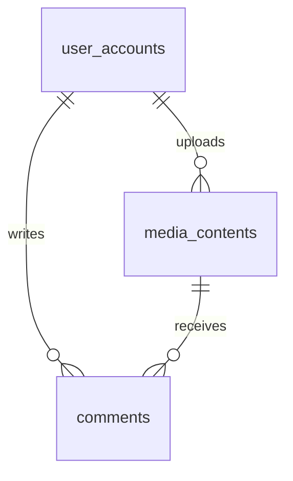

# MediaFlow Database Documentation

## 1. Overview
The MediaFlow database is designed to support a sleek, dark-themed content platform for sharing and interacting with photos and videos. It follows a relational model using PostgreSQL (Supabase).

## 2. Entity Relationship Summary
- **user_accounts**: Core entity representing registered users.
- **media_contents**: Central entity for user-uploaded assets, linked to users. Users can post text, videos or photos.
- **comments**: Interaction entity allowing users to discuss media content.

## 3. Table Definitions

### 3.1 `user_accounts`
**Purpose:** Stores user profile and authentication metadata.
| Column | Type | Constraints | Description |
| :--- | :--- | :--- | :--- |
| `id` | BIGINT UNSIGNED | PRIMARY KEY, AUTO_INCREMENT | Unique identifier. |
| `username` | VARCHAR(255) | UNIQUE, NOT NULL | Public handle. |
| `email` | VARCHAR(255) | UNIQUE, NOT NULL | User's email for login/comms. |
| `display_name`| VARCHAR(255) | NOT NULL | User's preferred name. |
| `avatar_url` | VARCHAR(255) | NULL | URL to profile image. |
| `bio` | TEXT | NULL | Short user biography. |
| `created_at` | DATETIME | DEFAULT CURRENT_TIMESTAMP | Registration date. |
| `updated_at` | DATETIME | DEFAULT CURRENT_TIMESTAMP | Last profile update. |

### 3.2 `media_contents`
**Purpose:** Records metadata for uploaded media files.
| Column | Type | Constraints | Description |
| :--- | :--- | :--- | :--- |
| `id` | BIGINT UNSIGNED | PRIMARY KEY, AUTO_INCREMENT | Unique identifier. |
| `uploader_id` | BIGINT UNSIGNED | FK (user_accounts.id) | Link to the owner. |
| `type` | ENUM('photo', 'video')| NOT NULL | Type of media. |
| `title` | VARCHAR(255) | NOT NULL | Media title. |
| `description` | TEXT | NULL | Optional description (used for text posts or captions). |
| `media_url` | VARCHAR(255) | NOT NULL | Path/URL to original file. |
| `thumbnail_url`| VARCHAR(255) | NOT NULL | Path/URL to preview image. |
| `views_count` | BIGINT UNSIGNED | DEFAULT 0 | Counter for views. |
| `likes_count` | BIGINT UNSIGNED | DEFAULT 0 | Counter for likes. |

### 3.3 `comments`
**Purpose:** Stores user feedback on specific media items.
| Column | Type | Constraints | Description |
| :--- | :--- | :--- | :--- |
| `id` | BIGINT UNSIGNED | PRIMARY KEY, AUTO_INCREMENT | Unique identifier. |
| `media_id` | BIGINT UNSIGNED | FK (media_contents.id) | Target media. |
| `author_id` | BIGINT UNSIGNED | FK (user_accounts.id) | Commenter's ID. |
| `content` | TEXT | NOT NULL | Comment text. |
| `created_at` | DATETIME | DEFAULT CURRENT_TIMESTAMP | Time of posting. |

## 4. Relationship Diagram (Conceptual)


## 5. Security & Maintenance
- **Encryption:** All connections MUST use TLS/SSL.
- **Backups:** Daily incremental backups of the schema and data are performed.
- **Audit:** All DDL operations are logged in the `schema_migrations` table.

## 6. Database Access & Implementation
The application uses a Repository pattern with Zod validation for robust database interaction.

### 6.1 Core Connection
- **Path:** `src/lib/db.ts`
- **Features:** Connection pooling (`pg`), SSL support, and automatic session variable configuration.
- **Transaction Support:** Provided via the `withTransaction` wrapper.

### 6.2 Data Validation
- **Path:** `src/lib/validations.ts`
- **Tool:** Zod
- **Ensures:** Data types, lengths, and formats match PostgreSQL schema constraints before execution.

### 6.3 Repositories
Located in `src/lib/repositories/`, these classes handle all CRUD operations:
- `UserRepository`: Profile management and user lookups.
- `MediaRepository`: Handling uploads, view counts, and likes.
- `CommentRepository`: Discussion threads with user metadata joins.

### 6.4 Usage Example
```typescript
import { UserRepository } from './lib/repositories';
import { withTransaction } from './lib/db';

const userRepo = new UserRepository();
```
